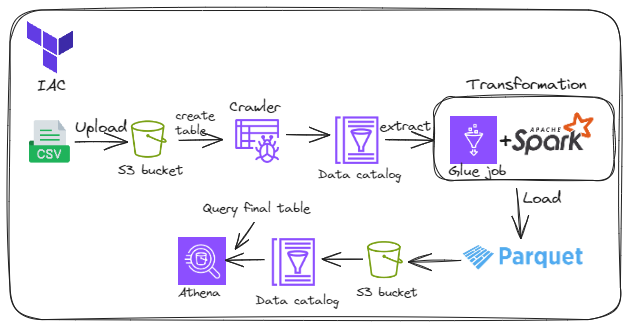
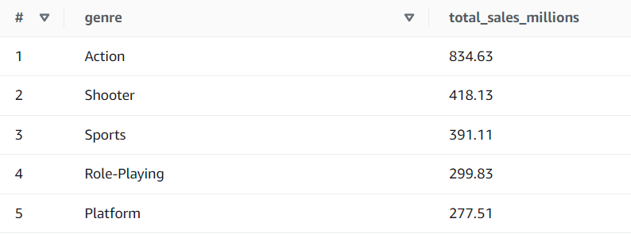

# Overview

## Tech Stack 
- Terraform
- Github actions (ci/cd)
- AWS Glue Data Catalog
- AWS Glue Crawler
- AWS Glue ETL Job
- Apache Spark
- Amazon S3
- Amazon Athena
- SQL
- Python

## Overview 
In this project, we create an ETL job on AWS using Terraform, which will load a CSV file containing video game sales data on S3, crawl that data to create a table, then use AWS ETL job with Spark to process that video game sales data, and build a report showcasing, for each year and by platform, the best video game genre in terms of sales.

For this, we create Terraform code that will spin up our infrastructure. Then we chose to manually run the crawler (but we could have scheduled this to run every day, for example).

We then use Athena to query the report.

## IAM Roles 
First of all, we have created the necessary policy and role for AWS Glue to be able to connect to S3 with AWS Glue. We added the following policies:
- AmazonS3FullAccess
- AWSGlueServiceRole

## Glue ETL Job using Spark script 
To build the report, we performed these tasks:
- Removed duplicates
- Removed unnecessary columns
- Removed nulls 
- Filtered by year 
- We then grouped the data by Year, Platform, and Genre, and selected the top genre in terms of sales for each year and platform using window function.
After that, converted our Spark data frame back into a Glue dynamic frame. Then wrote the data both to the S3 bucket and created a corresponding table in the Data Catalog.

## Top genre based on total sales
Let's query the data and see the top 5 genres.
P.S: I like sports and action games :)
