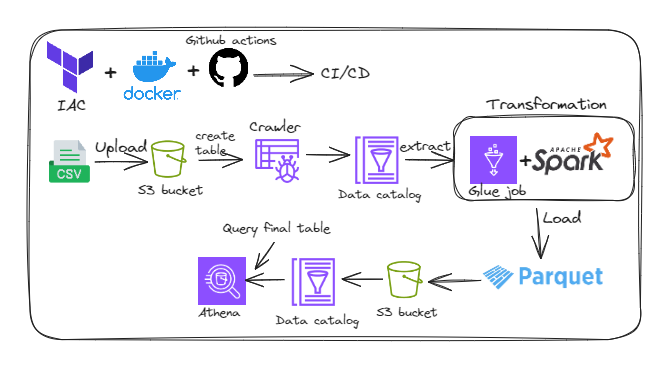

# Overview

## Tech Stack 
* AWS Glue Data Catalog
* AWS Glue Crawler
* AWS Glue ETL Job
* Apache Spark
* Amazon S3
* Amazon Athena
* SQL
* Python

## Overview 
In this project, we will first create a new S3 bucket and upload a remote CSV file into that S3 bucket. We are going to create a Data Catalog using either Crawler or a custom schema. Once all is created, we are going to create a new Glue ETL Job. We will do some transformations using Spark. Once our data frame is clear and ready, we will upload it as a parquet file to S3 and will create a corresponding Data Catalog as well. We are going to query the data using Athena and S3 Select.

## IAM Roles 
First of all, we have created the necessary policy and role for AWS Glue to be able to watch the logs and connect to S3.We added the followinf policies : 
* AmazonS3FullAccess
* CloudWatchFullAccessV2
* AwsGlueServiceRole

## S3 Bucket
After creating the necessary IAM role, we created the S3 bucket. This bucket will be used both to get the initial data and upload the final data. For this project we used a bucket named "video-game-etl".. We uploaded our initial CSV file into this bucket with the key initial-dataset/vgsales.csv. We used this file as our main source of data.

## Glue Crawler / Data Catalog
In this part, the first thing was creating a new database. We can create the database from AWS Glue -> Databases -> Add database. We named it video-games-data.

The second part is creating a new table in this database. We used this table to keep the metadata of the object we recently put into the S3 bucket. We could do it both using Crawler and by editing the schema manually. We went through using a crawler.

## Glue ETL Job using Spark script 
The main purpose of this Glue ETL job is to modify the source CSV file using the Glue Data Catalog and upload the modified data frame in the parquet format into S3 and create a corresponding target data catalog that keeps the metadata information of the target object.
We created a job using the Visual source and target.
For this specific task, choosing the minimum resource power was enough since the data loaded is not that big. We chose the number of workers as 2 and the worker type as G 1X.

After configuring our script, we could create our script. The first part was automatically provided by the Glue itself and it created a Glue dynamic frame. We added some specific imports and created a Spark data frame out of the Glue dynamic frame. (.py file)

We prepared our Spark data frame for further steps: 
* Removed duplicates
* Removed unnecessary columns
* Removed Nulls 
* Filtered by year 
We then grouped the data by Year, Platform and Genre, and selected the top genre in term of sales for each year and platform using window function.
After that, converted our Spark data frame back into a Glue dynamic frame. Then wrote the data both to the S3 bucket and created a corresponding table in the Data Catalog.

## Monitor Data Using AWS Athena and S3 Select
After the run was completed, the resulting parquet file was loaded inside the directory "parquet-format-data".

After checking the data in the S3 bucket, we also checked if the table was created in the Glue Data Catalog.

This led us through Amazon Athena. We then ran the below simple SQL query the see the first 10 rows of the data.
